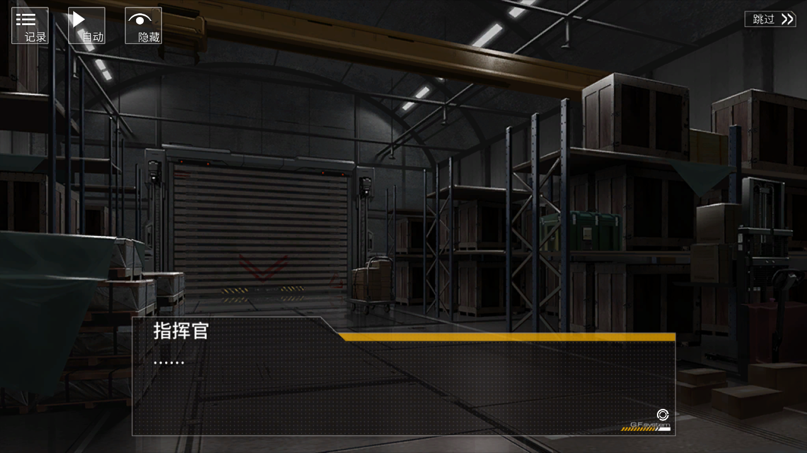

# 静默沙盘炼金术

## 一、食用方式

### 1.1 流程

1. 梯队1和梯队2使用两个铁血梯队；
2. “确认出击”至如下有剧情对话的位置，如图1所示：



3. 在上述界面直接开启脚本即可，每次执行会弹出一个powershell脚本用于地图缩放，属于正常现象。

## 1.2 注意

1. 铁血梯队不应配备“鬼步”（鬼影姿态）芯片；不应该配备“多带粮弹”（充足燃料）芯片。
2. 如果在“补给阶段”（见下方状态机）卡住，请关闭脚本手动执行补给，并结束本次循环；
3. 每次补给一个铁血梯队之后，会有3秒左右的等待，属于正常现象。

## 1.3 额外说明

由于Mica的垃圾服务器，会话可能存在延迟过高、丢包的问题。在计划模式1（铁血移动、指挥官绕圈）和计划模式2（指挥官向左下角移动）中，存在：

1. teamMove
2. noBattleMeet
3. buildingSkillPerformOnDeath
4. buildingSkillPerform

由于在“制造装备”和“使用装备”的判断上使用的是阻塞方式，如果网络不是特别卡顿（出现连续多次丢包），上述4中会话不会影响脚本稳定性。

但是在指挥官补给铁血的动作中，会有一个：

1. myforceSkillPerform

脚本会自动检测是否完成了对梯队的补给动作，如果没有补给成功则会重新补给，因此采用的非阻塞方式。此时为了避免丢包的影响，在这里设置了大概3秒的延迟。如果正常收包，则等待剩余时间脚本执行下一步；若脚本已经到执行下一步的事件还没有成功收包，那么将出现异常情况（只能重新启动脚本）。

## 二、状态机

简化状态机如下：

```
MAIN_LOOP:
    // 初始化阶段
    wait_for_skip_dialog_00()
    click_skip_00()
    zoom_out_map()
    move_map_1()
    move_map_2()
    
    // 部署阶段
    click_right_airport()
    if (detect_confirm_button()) {
        click_confirm()
    } else if (detect_cancel_button()) {
        click_cancel()
    } else if (detect_heavy_unit()) {
        switch_to_normal_unit()
        click_confirm()
    }
    
    click_left_airport()
    if (detect_confirm_button()) {
        click_confirm()
    } else if (detect_cancel_button()) {
        click_cancel()
    } else if (detect_heavy_unit()) {
        switch_to_normal_unit()
        click_confirm()
    }
    
    start_battle()
    
    // 战斗准备阶段
    wait_for_skip_dialog_01()
    click_skip_01()
    wait_for_briefing()
    close_briefing()
    
    // 第一轮战斗循环
    wait_for_turn_1()
    BATTLE_PHASE_1_LOOP:
        click_blank_area()
        
        PLAN_MODE_1_LOOP:
            click_plan_button()
            if (detect_planning_mode()) {
                break PLAN_MODE_1_LOOP
            } else {
                jump to PLAN_MODE_1_LOOP
            }
        
        // 执行梯队操作
        move_right_unit()
        move_left_unit()
        move_commander_clear_enemies()
        
        // 回合判断
        if (detect_turn_5()) {
            execute_plan()
            break BATTLE_PHASE_1_LOOP
        } else {
            jump to BATTLE_PHASE_1_LOOP
        }
    
    // 制造补给
    wait_for_create_supply()
    click_create_supply()
    move_map_3()
    
    // 第二轮战斗循环
    BATTLE_PHASE_2_LOOP:
        click_blank_area()
        
        PLAN_MODE_2_LOOP:
            click_plan_button()
            if (detect_planning_mode()) {
                break PLAN_MODE_2_LOOP
            } else {
                jump to PLAN_MODE_2_LOOP
            }
        
        // 指挥官移动
        move_commander_to_target()
        
        // 回合判断
        if (detect_turn_2()) {
            execute_plan()
            break BATTLE_PHASE_2_LOOP
        } else {
            jump to BATTLE_PHASE_2_LOOP
        }
    
    // 补给阶段
    SUPPLY_RIGHT_LOOP:
        wait_for_supply_device()
        use_supply_device()
        click_right_unit()
        if (detect_right_unit_supplied()) {
            break SUPPLY_RIGHT_LOOP
        } else {
            jump to SUPPLY_RIGHT_LOOP
        }
    
    SUPPLY_LEFT_LOOP:
        wait_for_supply_device()
        use_supply_device()
        click_left_unit()
        if (detect_left_unit_supplied()) {
            break SUPPLY_LEFT_LOOP
        } else {
            jump to SUPPLY_LEFT_LOOP
        }
    
    // 结算阶段
    wait_for_battle_end()
    click_battle_settlement()
    click_confirm()
    click_restart_battle_1()
    click_restart_battle_2()
    click_restart_battle_3()
    
    jump to MAIN_LOOP
```

完整状态机如下：

```
stateDiagram-v2
    [*] --> 主循环 : 开始

    主循环 --> 剧情对话_00 : 进入沙盒
    剧情对话_00 --> 点击跳过_00 : 检测到跳过按钮
    点击跳过_00 --> 缩小地图 : 跳过完成

    缩小地图 --> 地图平移1 : 缩放完成
    地图平移1 --> 地图平移2 : 平移1完成
    地图平移2 --> 部署铁血_R_点击机场 : 平移2完成

    state 右侧机场部署 {
        部署铁血_R_点击机场 --> 部署铁血_R_部署_点击确定 : 检测到"确定"
        部署铁血_R_点击机场 --> 部署铁血_R_已部署_点击取消 : 检测到"取消"
        部署铁血_R_点击机场 --> 部署铁血_R_重装部队_被选中 : 检测到重装部队
        
        部署铁血_R_重装部队_被选中 --> 部署铁血_R_重装部队_切换到普通梯队 : 检测到部署界面
        部署铁血_R_重装部队_切换到普通梯队 --> 部署铁血_R_部署_点击确定 : 切换完成
    }

    部署铁血_R_部署_点击确定 --> 部署铁血_L_点击机场 : 右侧部署完成
    部署铁血_R_已部署_点击取消 --> 部署铁血_L_点击机场 : 右侧已部署

    state 左侧机场部署 {
        部署铁血_L_点击机场 --> 部署铁血_L_部署_点击确定 : 检测到"确定"
        部署铁血_L_点击机场 --> 部署铁血_L_已部署_点击取消 : 检测到"取消"
        部署铁血_L_点击机场 --> 部署铁血_L_重装部队_被选中 : 检测到重装部队
        
        部署铁血_L_重装部队_被选中 --> 部署铁血_L_重装部队_切换到普通梯队 : 检测到部署界面
        部署铁血_L_重装部队_切换到普通梯队 --> 部署铁血_L_部署_点击确定 : 切换完成
    }

    部署铁血_L_部署_点击确定 --> 作战开始 : 左侧部署完成
    部署铁血_L_已部署_点击取消 --> 作战开始 : 左侧已部署

    作战开始 --> 剧情对话_01 : 作战开始
    剧情对话_01 --> 点击跳过_01 : 检测到跳过按钮
    点击跳过_01 --> 任务简报 : 跳过完成
    任务简报 --> 关闭简报 : 检测到关闭按钮
    关闭简报 --> 战斗阶段_初始状态判断 : 关闭完成

    战斗阶段_初始状态判断 --> 战斗阶段_计划模式_1_Begin : 检测到回合1

    state 第一轮战斗循环 {
        战斗阶段_计划模式_1_Begin --> 战斗阶段_计划模式_1_点击计划_Begin : 点击空白
        
        state 第一轮计划模式检测 {
            战斗阶段_计划模式_1_点击计划_Begin --> 战斗阶段_计划模式_1_点击计划_生效判断 : 点击计划
            战斗阶段_计划模式_1_点击计划_生效判断 --> 战斗阶段_计划模式_1_点击计划_检查是否进入计划模式 : 检查模式
            战斗阶段_计划模式_1_点击计划_生效判断 --> 战斗阶段_计划模式_1_点击计划_重新点击 : 未进入
            战斗阶段_计划模式_1_点击计划_检查是否进入计划模式 --> 战斗阶段_计划模式_1_铁血_R_点击梯队 : 进入计划模式
            战斗阶段_计划模式_1_点击计划_重新点击 --> 战斗阶段_计划模式_1_点击计划_Begin : 重新尝试
        }
        
        state 第一轮梯队操作序列 {
            战斗阶段_计划模式_1_铁血_R_点击梯队 --> 战斗阶段_计划模式_1_铁血_R_点击目标地点
            战斗阶段_计划模式_1_铁血_R_点击目标地点 --> 战斗阶段_计划模式_1_铁血_R_点击空白位置
            战斗阶段_计划模式_1_铁血_R_点击空白位置 --> 战斗阶段_计划模式_1_铁血_L_点击梯队
            战斗阶段_计划模式_1_铁血_L_点击梯队 --> 战斗阶段_计划模式_1_铁血_L_点击目标地点
            战斗阶段_计划模式_1_铁血_L_点击目标地点 --> 战斗阶段_计划模式_1_铁血_L_点击空白位置
            战斗阶段_计划模式_1_铁血_L_点击空白位置 --> 战斗阶段_计划模式_1_指挥官_点击梯队
            战斗阶段_计划模式_1_指挥官_点击梯队 --> 战斗阶段_计划模式_1_指挥官_杂鱼_R
            战斗阶段_计划模式_1_指挥官_杂鱼_R --> 战斗阶段_计划模式_1_指挥官_杂鱼_U
            战斗阶段_计划模式_1_指挥官_杂鱼_U --> 战斗阶段_计划模式_1_指挥官_返回初始位置
        }
        
        战斗阶段_计划模式_1_指挥官_返回初始位置 --> 战斗阶段_计划模式_1_回合判断 : 操作完成
        
        state 第一轮回合判断 {
            战斗阶段_计划模式_1_回合判断 --> 战斗阶段_计划模式_1_检查回合5 : 检查回合
            战斗阶段_计划模式_1_回合判断 --> 战斗阶段_计划模式_1_继续循环 : 检查回合
            战斗阶段_计划模式_1_检查回合5 --> 战斗阶段_计划模式_1_执行计划 : 第5回合
            战斗阶段_计划模式_1_继续循环 --> 战斗阶段_计划模式_1_Begin : 继续战斗
        }
    }

    战斗阶段_计划模式_1_执行计划 --> 战斗阶段_指挥官_制造补给_判断 : 执行完成
    战斗阶段_指挥官_制造补给_判断 --> 战斗阶段_指挥官_制造补给_点击制造 : 检测到制造按钮
    战斗阶段_指挥官_制造补给_点击制造 --> 地图平移3 : 制造完成

    地图平移3 --> 战斗阶段_计划模式_2_Begin : 平移完成

    state 第二轮战斗循环 {
        战斗阶段_计划模式_2_Begin --> 战斗阶段_计划模式_2_点击计划_Begin : 点击空白
        
        state 第二轮计划模式检测 {
            战斗阶段_计划模式_2_点击计划_Begin --> 战斗阶段_计划模式_2_点击计划_生效判断 : 点击计划
            战斗阶段_计划模式_2_点击计划_生效判断 --> 战斗阶段_计划模式_2_点击计划_检查是否进入计划模式 : 检查模式
            战斗阶段_计划模式_2_点击计划_生效判断 --> 战斗阶段_计划模式_2_点击计划_重新点击 : 未进入
            战斗阶段_计划模式_2_点击计划_检查是否进入计划模式 --> 战斗阶段_计划模式_2_指挥官_点击梯队 : 进入计划模式
            战斗阶段_计划模式_2_点击计划_重新点击 --> 战斗阶段_计划模式_2_点击计划_Begin : 重新尝试
        }
        
        战斗阶段_计划模式_2_指挥官_点击梯队 --> 战斗阶段_计划模式_2_指挥官_点击目标地点 : 选择指挥官
        战斗阶段_计划模式_2_指挥官_点击目标地点 --> 战斗阶段_计划模式_2_回合判断 : 设置目标
        
        state 第二轮回合判断 {
            战斗阶段_计划模式_2_回合判断 --> 战斗阶段_计划模式_2_检查回合2 : 检查回合
            战斗阶段_计划模式_2_回合判断 --> 战斗阶段_计划模式_2_继续循环 : 检查回合
            战斗阶段_计划模式_2_检查回合2 --> 战斗阶段_计划模式_2_执行计划 : 第2回合
            战斗阶段_计划模式_2_继续循环 --> 战斗阶段_计划模式_2_Begin : 继续战斗
        }
    }

    战斗阶段_计划模式_2_执行计划 --> 战斗阶段_指挥官_执行补给_铁血R_Begin : 执行完成

    state 右侧补给循环 {
        战斗阶段_指挥官_执行补给_铁血R_Begin --> 战斗阶段_指挥官_执行补给_铁血R_判断_使用装置 : 开始右侧补给
        战斗阶段_指挥官_执行补给_铁血R_判断_使用装置 --> 战斗阶段_指挥官_执行补给_铁血R_使用装置 : 检测到补给按钮
        战斗阶段_指挥官_执行补给_铁血R_使用装置 --> 战斗阶段_指挥官_执行补给_铁血R_点击梯队 : 使用装置
        战斗阶段_指挥官_执行补给_铁血R_点击梯队 --> 战斗阶段_指挥官_执行补给_铁血R_补给是否成功 : 点击梯队
        
        state 右侧补给验证 {
            战斗阶段_指挥官_执行补给_铁血R_补给是否成功 --> 战斗阶段_指挥官_执行补给_铁血R_检查补给状态 : 验证成功
            战斗阶段_指挥官_执行补给_铁血R_补给是否成功 --> 战斗阶段_指挥官_执行补给_铁血R_重新补给 : 验证失败
            战斗阶段_指挥官_执行补给_铁血R_检查补给状态 --> 战斗阶段_指挥官_执行补给_铁血L_Begin : 补给成功
            战斗阶段_指挥官_执行补给_铁血R_重新补给 --> 战斗阶段_指挥官_执行补给_铁血R_Begin : 重新尝试
        }
    }

    state 左侧补给循环 {
        战斗阶段_指挥官_执行补给_铁血L_Begin --> 战斗阶段_指挥官_执行补给_铁血L_判断_使用装置 : 开始左侧补给
        战斗阶段_指挥官_执行补给_铁血L_判断_使用装置 --> 战斗阶段_指挥官_执行补给_铁血L_使用装置 : 检测到补给按钮
        战斗阶段_指挥官_执行补给_铁血L_使用装置 --> 战斗阶段_指挥官_执行补给_铁血L_点击梯队 : 使用装置
        战斗阶段_指挥官_执行补给_铁血L_点击梯队 --> 战斗阶段_指挥官_执行补给_铁血L_补给是否成功 : 点击梯队
        
        state 左侧补给验证 {
            战斗阶段_指挥官_执行补给_铁血L_补给是否成功 --> 战斗阶段_指挥官_执行补给_铁血L_检查补给状态 : 验证成功
            战斗阶段_指挥官_执行补给_铁血L_补给是否成功 --> 战斗阶段_指挥官_执行补给_铁血L_重新补给 : 验证失败
            战斗阶段_指挥官_执行补给_铁血L_检查补给状态 --> 结算_判断 : 补给成功
            战斗阶段_指挥官_执行补给_铁血L_重新补给 --> 战斗阶段_指挥官_执行补给_铁血L_Begin : 重新尝试
        }
    }

    state 结算阶段 {
        结算_判断 --> 结算_点击战役结算 : 检测到结算界面
        结算_点击战役结算 --> 结算_确定
        结算_确定 --> 再次作战_1
        再次作战_1 --> 再次作战_2
        再次作战_2 --> 再次作战_3
    }

    再次作战_3 --> 主循环 : 开始新循环
```

# 向你微笑炼金术

## 食用方式

通关任意难度**向你微笑**，部署任意铁血梯队后将地图缩放至最小即可开启脚本食用。


